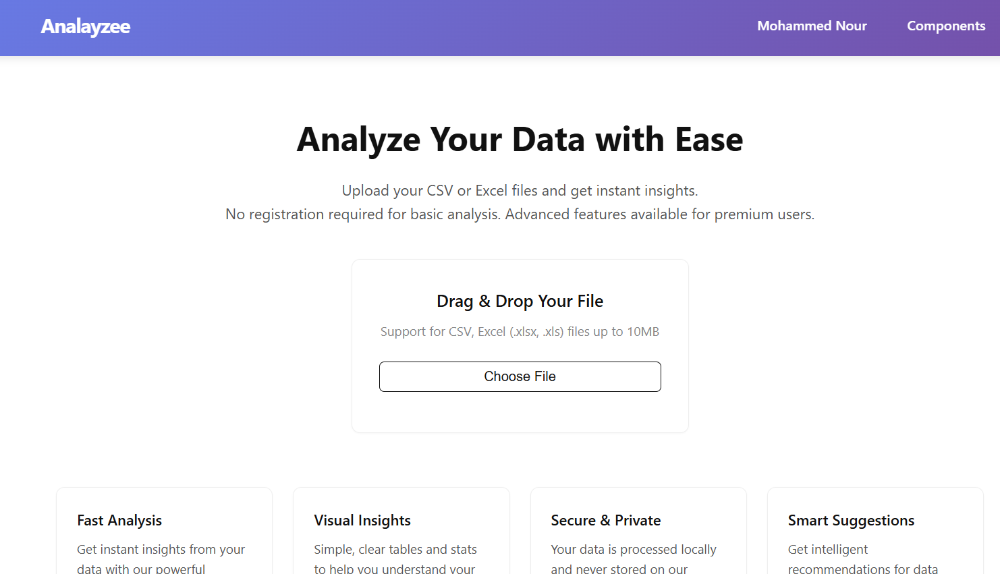
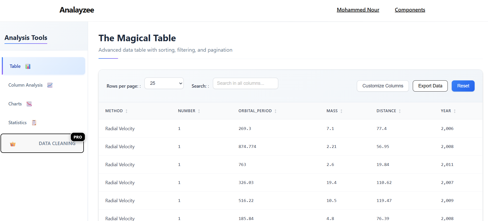
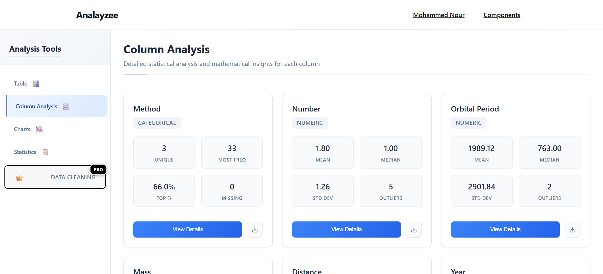
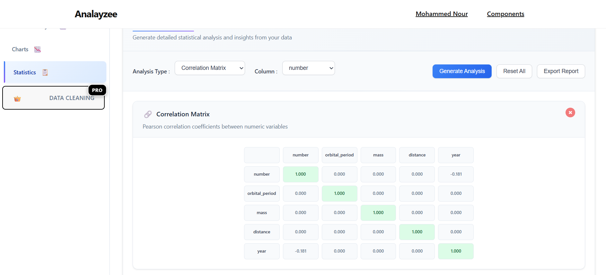

# 📊 Analayzee - Advanced CSV & Excel Data Analysis Platform


Analayzee is a powerful web-based data analysis platform that allows users to upload, analyze, visualize, and clean CSV and Excel files with advanced statistical tools and interactive visualizations.

## ✨ Features

### 🔐 User Management & Authentication
- **User Registration & Login** with email-based authentication
- **Subscription System** with Free and Premium tiers
- **Profile Management** with password change functionality
- **Session Management** with secure authentication

### 📁 File Handling
- **Multi-format Support**: CSV, XLSX, XLS files
- **Smart File Processing**: Automatic encoding detection and parsing
- **File Validation**: Size limits and format checking
- **Session Storage**: Secure temporary data storage

### 📈 Data Analysis & Statistics
- **Descriptive Statistics**: Mean, median, mode, standard deviation, variance
- **Advanced Analytics**: Skewness, kurtosis, quartiles, IQR
- **Correlation Analysis**: Pearson correlation matrices with visual indicators
- **Outlier Detection**: IQR method with configurable thresholds
- **Distribution Analysis**: Histogram generation and frequency analysis
- **Data Insights**: AI-powered automated insights and recommendations

### 📊 Interactive Visualizations
- **Chart Types**: Bar, Line, Pie, Doughnut, Scatter plots, Histograms
- **Smart Filtering**: Automatic column type detection for appropriate visualizations
- **Export Options**: Download charts as PNG images
- **Responsive Design**: Mobile-friendly interactive charts
- **Multiple Charts**: Create and compare multiple visualizations

### 🧹 Data Cleaning (Premium Feature)
- **Missing Value Handling**: Fill, interpolate, or remove missing data
- **Outlier Treatment**: Cap, remove, or mark outliers
- **Data Type Conversion**: Smart type conversion with error handling
- **Text Cleaning**: Normalize, clean, and standardize text data
- **Duplicate Management**: Find and remove duplicate records
- **Data Normalization**: Min-max, z-score, and robust scaling

### 🎨 Modern User Interface
- **Responsive Design**: Works on desktop, tablet, and mobile
- **Interactive Components**: Dynamic tables with sorting and filtering
- **Tab-based Navigation**: Organized workflow with multiple analysis tabs
- **Real-time Updates**: Live data processing and visualization updates
- **Professional Styling**: Modern CSS with smooth animations

## 🚀 Quick Start

### Prerequisites
- Python 3.11 or higher
- pip (Python package manager)
- Git

### Installation

1. **Clone the repository**
   ```bash
   git clone https://github.com/yourusername/analayzee.git
   cd analayzee
   ```

2. **Create a virtual environment**
   ```bash
   python -m venv venv
   
   # On Windows
   venv\Scripts\activate
   
   # On macOS/Linux
   source venv/bin/activate
   ```

3. **Install dependencies**
   ```bash
   pip install -r requirements.txt
   ```

4. **Set up environment variables**
   ```bash
   cp .env.example .env
   ```
   
   Edit `.env` file with your configuration:
   ```env
   SECRET_KEY=your-secret-key-here
   DEBUG=True
   ALLOWED_HOSTS=localhost,127.0.0.1
   ```

5. **Run database migrations**
   ```bash
   python manage.py makemigrations
   python manage.py migrate
   ```

6. **Create a superuser (optional)**
   ```bash
   python manage.py createsuperuser
   ```

7. **Collect static files**
   ```bash
   python manage.py collectstatic
   ```

8. **Run the development server**
   ```bash
   python manage.py runserver
   ```

9. **Access the application**
   - Open your browser and go to `http://127.0.0.1:8000/`
   - Register a new account or login
   - Upload a CSV/Excel file and start analyzing!

## 🏗️ Project Structure

```
Analayzee/
├── manage.py                    # Django management script
├── requirements.txt             # Python dependencies
├── requirements-prod.txt        # Production dependencies
├── .env.example                # Environment variables template
├── .gitignore                  # Git ignore file
├── README.md                   # This file
├── db.sqlite3                  # SQLite database (development)
├── Analayzee/                  # Main project directory
│   ├── __init__.py
│   ├── settings.py             # Django settings
│   ├── urls.py                 # URL configuration
│   ├── wsgi.py                 # WSGI configuration
│   └── asgi.py                 # ASGI configuration
├── accounts/                   # User management app
│   ├── models.py               # User and subscription models
│   ├── views.py                # Authentication views
│   ├── forms.py                # User forms
│   ├── backends.py             # Custom authentication backend
│   └── utils.py                # Utility functions
├── main/                       # Core application
│   ├── models.py               # Data models
│   ├── views.py                # Main application views
│   └── urls.py                 # URL patterns
├── templates/                  # HTML templates
│   ├── base.html               # Base template
│   ├── showcase.html           # Landing page
│   ├── accounts/               # Authentication templates
│   └── main/                   # Analysis templates
├── static/                     # Static files
│   ├── css/                    # Stylesheets
│   └── js/                     # JavaScript files
├── uml_diagrams/               # System documentation
└── screenshots/                # Application screenshots
```

## 🛠️ Development

### Running Tests
```bash
python manage.py test
```

### Code Quality
```bash
# Format code with black
black .

# Check code style
flake8 .

# Type checking
mypy .
```

### Development Commands
```bash
# Create new Django app
python manage.py startapp appname

# Make migrations for model changes
python manage.py makemigrations

# Apply migrations
python manage.py migrate

# Create superuser
python manage.py createsuperuser

# Collect static files
python manage.py collectstatic

# Run development server
python manage.py runserver
```

## 🚀 Deployment

### Environment Setup
1. Create production `.env` file with secure values
2. Set `DEBUG=False`
3. Configure `ALLOWED_HOSTS` with your domain
4. Set up PostgreSQL database
5. Configure static file serving

### Using Gunicorn
```bash
# Install production dependencies
pip install -r requirements-prod.txt

# Collect static files
python manage.py collectstatic --noinput

# Run migrations
python manage.py migrate

# Start Gunicorn server
gunicorn Analayzee.wsgi:application --bind 0.0.0.0:8000
```

### Using Docker (Optional)
```dockerfile
# Dockerfile example
FROM python:3.11
WORKDIR /app
COPY requirements-prod.txt .
RUN pip install -r requirements-prod.txt
COPY . .
RUN python manage.py collectstatic --noinput
EXPOSE 8000
CMD ["gunicorn", "Analayzee.wsgi:application", "--bind", "0.0.0.0:8000"]
```

## 📊 System Architecture

The application follows Django's MVC pattern with these key components:

- **Models**: User management, subscription system, data storage
- **Views**: File upload, data processing, analysis endpoints
- **Templates**: Responsive HTML with modern CSS
- **Static Files**: JavaScript for interactivity, CSS for styling

### Key Technologies
- **Backend**: Django 5.2, Python 3.11+
- **Frontend**: HTML5, CSS3, JavaScript (ES6+)
- **Database**: SQLite (development), PostgreSQL (production)
- **Data Processing**: Pandas, NumPy
- **Visualization**: Chart.js
- **Authentication**: Django's built-in auth with custom backends

## 🔒 Security Features

- **CSRF Protection**: Built-in Django CSRF protection
- **XSS Prevention**: Content security and input sanitization  
- **SQL Injection Protection**: Django ORM with parameterized queries
- **Secure Sessions**: HTTP-only, secure session cookies
- **Password Security**: Strong password validation and hashing
- **File Upload Security**: Type validation and size limits

## 📈 Performance

- **Efficient Data Processing**: Optimized pandas operations
- **Session Management**: Smart caching of analysis results
- **Static File Optimization**: CSS/JS minification and compression
- **Database Optimization**: Proper indexing and query optimization
- **Responsive Design**: Fast loading on all devices

## 🤝 Contributing

1. Fork the repository
2. Create a feature branch (`git checkout -b feature/amazing-feature`)
3. Commit your changes (`git commit -m 'Add amazing feature'`)
4. Push to the branch (`git push origin feature/amazing-feature`)
5. Open a Pull Request

### Development Guidelines
- Follow PEP 8 style guidelines
- Write unit tests for new features
- Update documentation for API changes
- Use meaningful commit messages

## 📝 License

This project is licensed under the MIT License - see the [LICENSE](LICENSE) file for details.

## 🆘 Support

- **Documentation**: Check the `/uml_diagrams/` folder for system architecture
- **Issues**: Report bugs and request features via GitHub Issues
- **Email**: your-email@example.com

## 🙏 Acknowledgments

- Django framework for robust web development
- Pandas library for data manipulation
- Chart.js for beautiful visualizations
- Bootstrap for responsive design components

## 📊 Screenshots


*File upload interface with drag-and-drop functionality*


*Comprehensive data analysis dashboard*


*Interactive charts and visualizations*


*Advanced statistical analysis tools*

---

**Built with ❤️ by [Your Name]**

*Analayzee - Making data analysis accessible to everyone*
